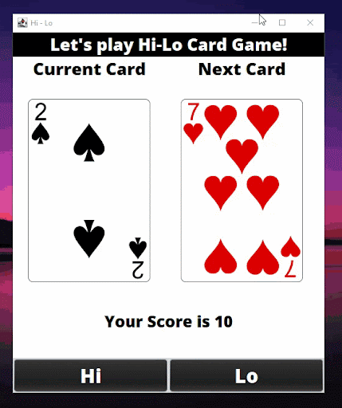

# Event Driven Programming - Hi Lo Game

## Table of contents

- [Overview](#overview)
  - [Screenshot](#screenshot)
- [My process](#my-process)
  - [Built with](#built-with)
  - [What I learned](#what-i-learned)
- [Author](#author)
- [Acknowledgments](#acknowledgments)

## Overview

### Screenshot

#### Hi Lo Preview
---

## My process

### Built with

- Java Swing

### What I learned

Learned the use of imports of various java libraries, including those for GUI components and event handling. Implement a game logic methods such as setAnswer(boolean flag) for determining if the player's guess is correct, setscore(boolean isWin) for updating the player's score, and execute() for simulating the card draw and handling game events.

## Author

- Website - [Shanice](https://github.com/sdacleofe/about-me)

## Acknowledgments

I want to express my gratitude to my event-driven programming course instructor for imparting knowledge about the concept of Java GUI to us.

**This laboratory activity was made on March 30, 2022**